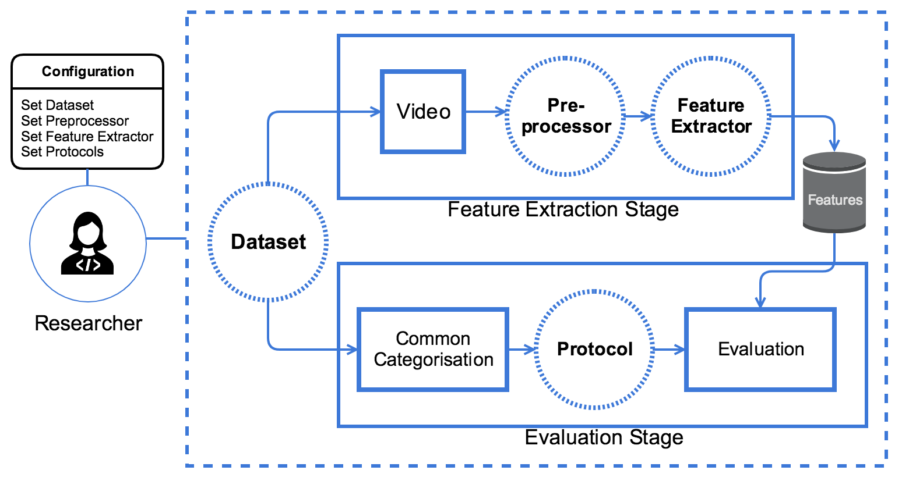
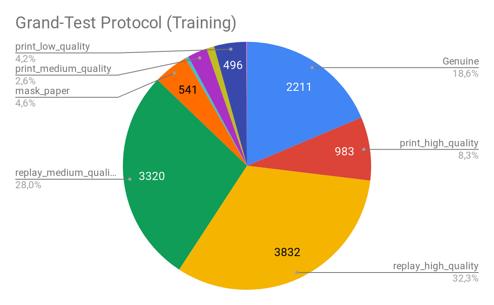

.. vim: set fileencoding=utf-8 :
.. Biometrics Team  <biometrics.support@gradiant.com>

=======================
The GRAD-GPAD framework
=======================

In this paper, we present a novel evaluation framework to help the research community to address the problem of generalization in face-PAD. Our framework is publicly available as a Python package under the acronym
GRAD-GPAD (Generalization Representation over Aggregated Datasets for Generalized Presentation Attack Detection). This framework provides a common taxonomy of existing datasets and allows to evaluate face-PAD algorithms
from additional points of view, revealing new interesting properties. The GRAD-GPAD framework is extendable and scalable by design. This will help researchers to create new
protocols, to define categorizations over different datasets in order to make them compatible, and to enable the addition of new datasets.

The GRAD-GPAD framework has a top-down design and provides a very convenient level of abstraction. The following figure shows the proposed dataset evaluation pipeline, where circles with dotted lines represent the customizable and easyto-extend elements. Each of these elements in the framework follows a specific interface to work properly. Thus,
we can add, for instance, a new Dataset (e.g. using some videos recorded for an specific use case), or a new implementation of a Feature Extractor to evaluate an algorithm
or even create an ad-hoc Protocol.

Figure 1: Overview of GRAD-GPAD evaluation framework

GRAD-GPAD presents two main stages:

    i) feature extraction, where features are computed for each input video applying a preprocessing step and following the interface of the Feature Extractor; and
    ii) evaluation, where a filtering step is applied, using the already extracted features and the common categorization of the datasets, to train and test over the selected features.

In the time of the publication, the UVAD dataset haven't been parsed yet. Fortunately, now is available in the GRAD-GPAD framework.
From the following figures we may observe how is distributed the proposed Aggregate Dataset for the Grandtest protocol.

.. image:: img/grad-gpad-grandtest.png
   :scale: 40 %
   :alt: proposed_evaluation_framework
   :align: center

Note:

    The baseline for evaluation in the GRAD-GPAD without UVAD are the results reported in this paper,
    whereas the baseline to evaluate with the new version of the GRAD-GPAD (with UVAD) are the results presented in the paper `Deep Anomaly Detection for Generalized Face Anti-Spoofing <https://arxiv.org/pdf/1904.08241.pdf>`_.

How to run my own experiment with GRAD-GPAD python framework?
-------------------------------------------------------------

Once we have available the publicly datasets, we have to create a json with the :code:`ROOT_PATH` of each dataset. Take the following file as an example:

.. literalinclude:: examples/database_paths.json

To design your Features extractor, just follow the interface :code:`FeaturesExtractor`.
Create a python file (e.g :code:`bob/paper/icb2019/gradgpad/classes/mypad/mypad_features_extractor.py`)

.. code-block:: python
    :linenos:
    :emphasize-lines: 36

    #!/usr/bin/env python

    import numpy as np
    from bob.gradiant.core import FeaturesExtractor
    from bob.paper.icb2019.gradgpad.classes.utils.preprocess import preprocess_image

    class MyPADFeaturesExtractor(FeaturesExtractor):
        """
        Here I can define my PAD algorithm to extract the features
        """

        def __init__(self, face_crop=False):
            self.face_crop = face_crop
            super(MyPADFeaturesExtractor, self).__init__()

        def run(self, dict_images, annotations=None):

            dict_features = {}
            sorted_keys = sorted(list(dict_images), key=int)
            for key in sorted_keys:
                try:
                    image = dict_images[key]['rgb']
                except IndexError:
                    image = dict_images[key]

                if self.face_crop and annotations:
                    if key not in annotations:
                        continue
                    preprocessed_image = preprocess_image(image, annotations[key])
                    if preprocessed_image is None:
                        continue
                    image = preprocessed_image

                #Add here your code
                features = get_features_from_an_image(image)

                dict_features[key] = features
            return dict_features

We encourage the unit testing of your features extractors to avoid integration bugs. Check the output from different inputs.
Please, check the test examples in :code:`bob/paper/icb2019/gradgpad/test`.

Then, we should decide the training pipeline. In this repo we have a provider to illustrate this step.

Example (:code:`experiments/helpers/pipeline_provider.py`)

.. literalinclude:: examples/pipeline_provider.py

Just before running the experiment you should design your experiment filling out a configuration file in order to run all of the evaluation protocols.

For instance, yo can create a file :code:`experiment/mypad/configuration_mypad.py` with the following fields

.. code-block:: python
    :linenos:
    :emphasize-lines: 13,21,24

    #!/usr/bin/env python
    from experiments.helpers.aggregate_database_provider import aggregate_database_provider, get_available_protocols
    from experiments.helpers.defaults import DEFAULT_DATABASE_PATHS_CONFIG_FILE, \
        DEFAULT_BASE_RESULT_PATH, DEFAULT_ACCESS_GRID_CONFIG, DEFAULT_NUMBER_THREADS
    from bob.paper.icb2019.gradgpad import MyPADFeaturesExtractor

    # REQUIRED ARGUMENTS:

    # Database paths:
    # * You need to add a json file with the information of the databases
    from experiments.helpers.pipeline_provider import get_pipeline_average_features_scaled_rbfsvc

    database_paths_filename = DEFAULT_DATABASE_PATHS_CONFIG_FILE # <- your previously defined json file

    # Database and protocol:
    aggregate_database = aggregate_database_provider(database_paths_filename)
    databases_list = [aggregate_database]
    protocols_list = get_available_protocols()

    # Feature extraction:
    feature_extractor = MyPADFeaturesExtractor() # <- your previously defined feature extractor

    # Pipeline:
    pipeline = get_pipeline_average_features_scaled_rbfsvc('mypad') <- your previously defined training pipeline

    # Result base path:
    name_feature_extractor = feature_extractor.__class__.__name__.lower().replace('featuresextractor', '')
    result_path = '{}/{}'.format(DEFAULT_BASE_RESULT_PATH, name_feature_extractor)

    # Framerate and time parameters:
    access_grid_config = DEFAULT_ACCESS_GRID_CONFIG

    # -----------------------------------------------------------------
    # OPTIONAL ARGUMENTS:

    # Pad evaluation comparative using the framework bob.gradiant.pad.comparative
    categorized_scores_plotter = None

    # Verbose (only True/False are valid):
    verbose = True

    # Number of threads for parallelizing the features extraction:
    number_threads = DEFAULT_NUMBER_THREADS

    # Data augmentation:
    use_data_augmentation = False

    # Features extraction:
    skip_features_extraction = False
    #extracted_features_path = ''
    #dict_extracted_features_paths = {'aggregate-database': {'ACE': extracted_features_path}}

    # Training: you can skip training stage
    skip_training = False

    # Scores prediction:
    skip_scores_prediction = False
    dict_scores_paths = dict()

    # Recreate: If it is true, features extraction will be done overwriting previous files
    recreate = False
    # -----------------------------------------------------------------

Emphasised lines (13,21,24) can be modified with your own implementation.

Finally, to run the experiment, just type:

.. code-block:: sh

    bin/algorithmic_constrained_evaluation.py -r experiment/mypad/configuration_mypad.py

Can the GRAD-GPAD framework be used in another platform/language/environment?
-----------------------------------------------------------------------------

The answer is yes, you can. We also provide several text list that define every of the protocols used.
This list are generated automatically from the framework. If you find any problem, please open an issue to try to solve it.

Find the protocols lists `here <https://github.com/Gradiant/bob.paper.icb2019.gradgpad/tree/master/gradgpad_protocols>`_.