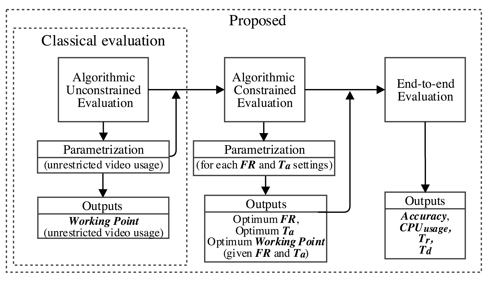
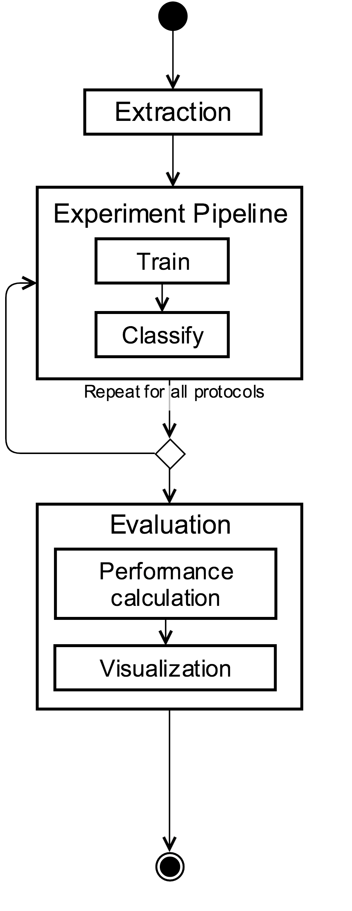
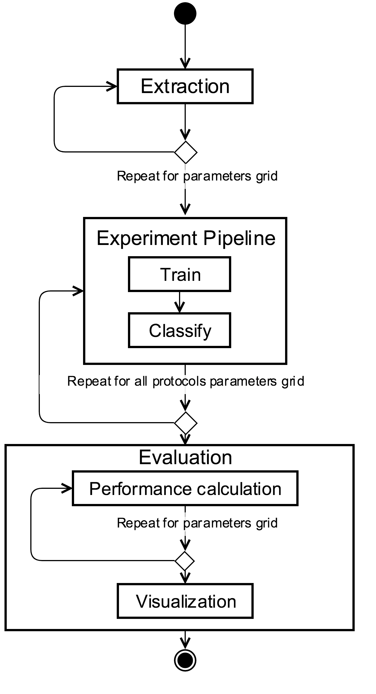
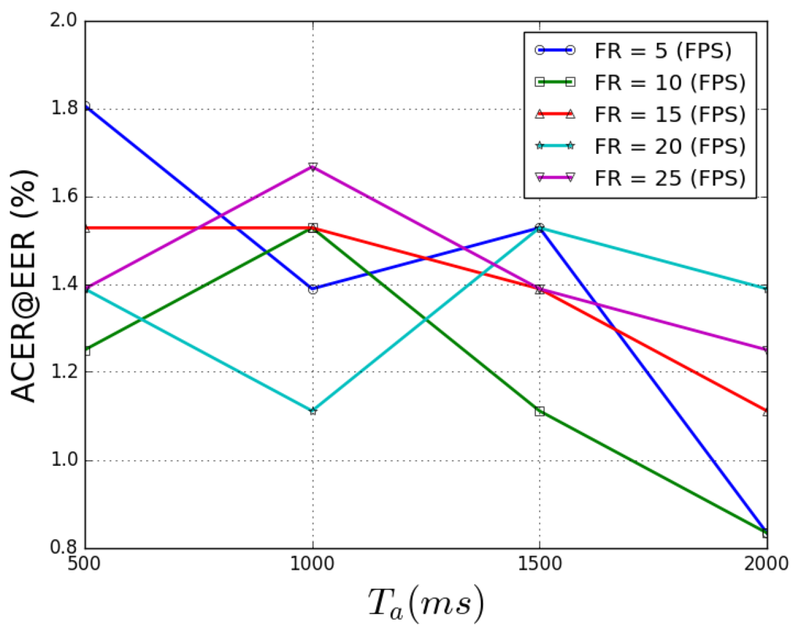
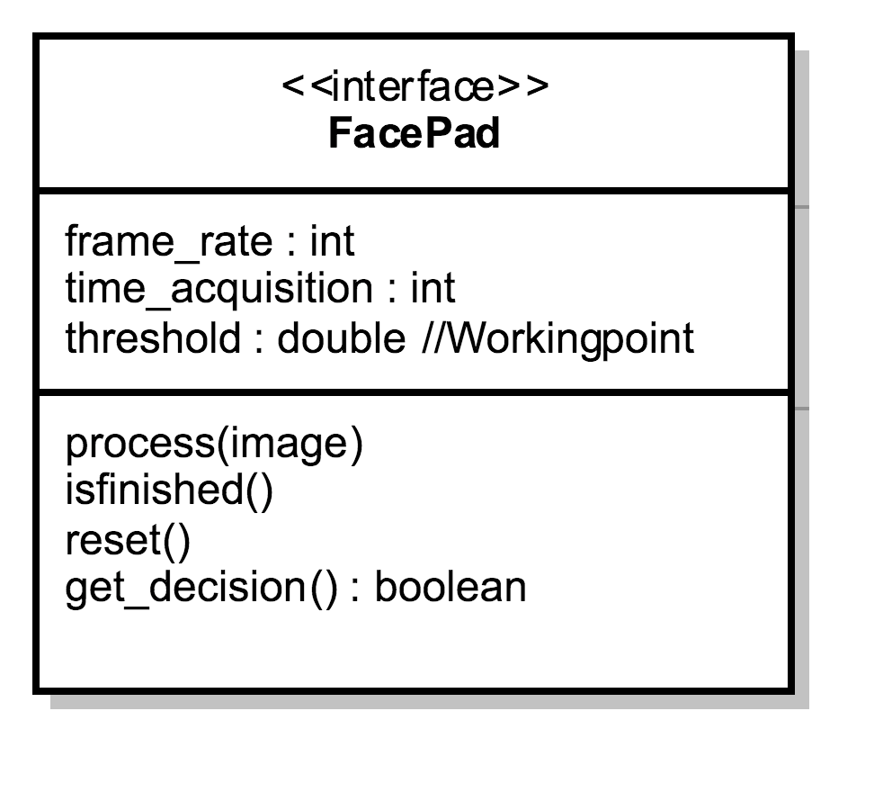

.. vim: set fileencoding=utf-8 :
.. Biometrics Team  <biometrics.support@gradiant.com>

==========
User Guide (TODO)
==========

We have designed a novel evaluation framework to better model the performance of a **face-PAD** method on a actual applications. The following evaluation procedures will help us to research some unstudied parameters and their influence in the performance of a deployed system.

• **Algorithmic Unconstrained Evaluation**, or **AUE** is the given name for a classical algorithmic evaluation. On this stage, every method is evaluated following defined database protocols, without any constraint about on-device implementation (i.e. Ta or FR). This classical evaluation is still fundamental in order to provide a fair performance comparison in terms of error rates, so we propose it to be the starting point for the design, develop and parameterization process of a face-PAD method. The calculated error rates and working points on this evaluation are only reliable for an unconstrained comparison of the algorithm, since unrestricted video duration and frame rate are used. These results and parameters should not be considered on a real implementation, nevertheless they can help on the initial parameterization of the algorithm.
• **Algorithmic Constrained Evaluation**, or **ACE**, provides information about performance and error rates related to an actual deployment constraints. More specifically, FR (frame rate) and Ta (total time of acquisition). This stage consists of evaluating a method cloning each input video but simulating different acquisition settings, obtaining, this way, valuable information to forecast the face- PAD performance. From this evaluation we can determine the best configuration of a face-PAD accompanied by a WorkingPoint (normally represented by a Threshold) for a given FR and Ta.
• **End-to-end Evaluation**: Once a parameterization laboratory was finished (using both of previous evaluation stages), it is necessary to evaluate the whole system (determined by optimum FR, Ta and a WorkingPoint). This protocol simulates the final behaviour of a face-PAD on an actual deployment using a bunch of videos. This end-to-end evaluation provides interesting information about the actual conditions on Tr (total time of system response), Td (time of decision) and CPUusage over a selected subset of videos. Although this evaluation is very useful for an initial decision concerning implementation parameters, we should keep in mind that it does not replace the end-to-end tests running in an actual production device.

How to setup your experiment
----------------------------

To run all of the evaluation protocols you must design your experiment filling out a configuration file. There is a script for creating your configuration file:

.. code-block:: sh

   $ bin/create_configuration_file.py -f config_experiment.py

Algorithmic Unconstrained Evaluation
------------------------------------

Execute the **Algorithmic Unconstrained Evaluation**:

.. code-block:: sh

   $ bin/algorithmic_unconstrained_evaluation.py -r config_experiment.py

There is a IQM-based configuration file available:

.. code-block:: sh

   $ bin/algorithmic_unconstrained_evaluation.py -r configuration_iqm.py

Note that here this protocols does not consider the parameters *framerate_list* and *total_time_acquisition_list*
It will ignore END-TO-END ARGUMENTS

Algorithmic Constrained Evaluation
------------------------------------

Execute the **Algorithmic Constrained Evaluation**:

.. code-block:: sh

   $ bin/algorithmic_constrained_evaluation.py -r config_experiment.py

There is a IQM-based configuration file available:

.. code-block:: sh

   $ bin/algorithmic_constrained_evaluation.py -r configuration_iqm.py

You will obtain a figure with the performance over all the parameters selected:

Note that here this protocols takes into account the parameters *framerate_list* and *total_time_acquisition_list*. It will create a parameter grid to cover all combinations.
It will ignore END-TO-END ARGUMENTS

End to end Evaluation
---------------------

You must fill out a face_pad parameter with a implementation of ``bob.gradiant.pad.evaluator.FacePad``

Execute the **End-to-end Evaluation**:

.. code-block:: sh

   $ bin/bin/end_to_end_evaluation.py -r config_experiment.py

There is a IQM-based configuration file available with a prepared Iqm-based-face-PAD:

.. code-block:: sh

   $ bin/end_to_end_evaluation.py -r configuration_iqm.py

You will obtain a table like the following one:

